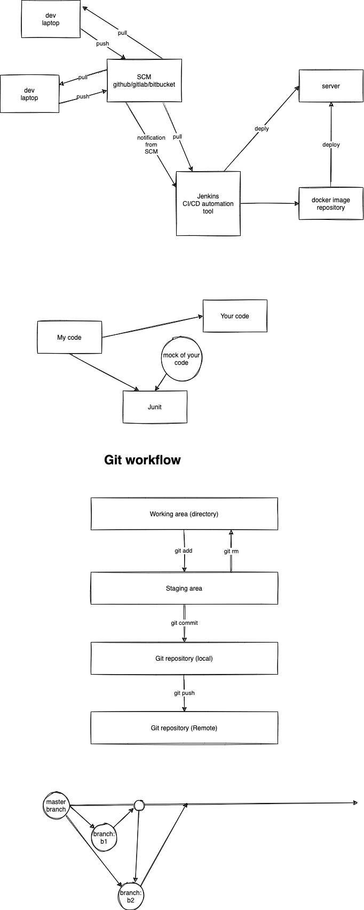

# Week 1 - Day 1

Topics:

-   Git for SCM
-   Introduction and Key Concepts
-   Setup Overview
-   Installing Git on a Mac via the Command Line
-   Git Configuration
-   Configuration Commands
-   Setup and Configuration
-   First Commit Commands
-   Working Locally
-   Gitting Historical
-   Removing Files
-   Moving Files
-   Ignoring Files
-   History and File Management Commands
-   Collaborating with Others -- Git Remotes and GitHub
-   Git Remote Commands
-   Going Remote

## Assignment

1. Make a list of all the git commands covered in the class and explain each of them with an example. Share the screenshots of your work (command execution) in the document along with the respective explanation.
