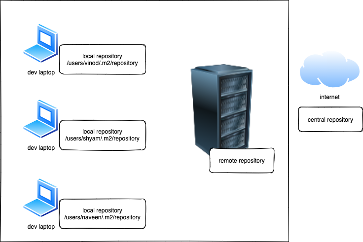

# Week1 / Day 2

# Assignment

Create a text document named **week1-day2-assignment.md** and write the answer/solution for the following questions:

1. What is Apache Maven and it's uses?
1. Explain the environment setup required to run the `mvn` command
1. Write about maven life cycle goals
1. Write about different elements in `pom.xml`
1. Create a simple Java quickstart project using the `mvn` command line tool. Explain the different options used in the command.
1. Create a simple Java quickstart project using the Maven extension in MS Visual Studio Code. Explain the process involved from start to end. Take screenshots and link them in the solution area of **week1-day2-assignment.md**.
1. Write about different types of maven repositories.
1. Write about maven dependencies with examples.
